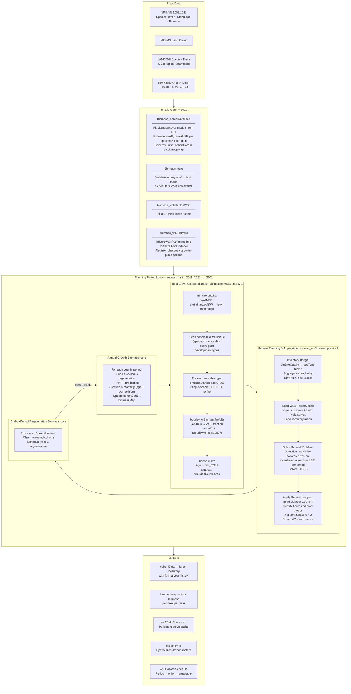

# WS3-LandR

NOTE: AI EXPERIMENTAL REPO. TECHNICALLY RUNS BUT STRONG POSSIBILITY IT IS SLOP AND/OR BROKEN

A coupled forest simulation framework integrating **LandR** (landscape-level forest succession) with **WS3** (wood supply optimization). The system simulates boreal forest growth over a 100-year horizon, generates merchantable volume yield curves, solves harvest schedules using linear programming, and feeds harvests back into the succession model.

**Study area**: Resource Inventory Area (RIA), British Columbia — TSA 08, 16, 24, 40, 41
**Temporal resolution**: Annual growth, 10-year harvest planning periods
**Spatial resolution**: 250 m pixels, Lambert Conformal Conic (NAD83)

---

## Simulation Schematic



---

## Module Overview

| Module | Role | Key Inputs | Key Outputs |
|---|---|---|---|
| **Biomass_borealDataPrep** | Parameterize succession from open Canadian data | NFI, NTEMS, study area | `species`, `speciesEcoregion`, `cohortData`, `pixelGroupMap` |
| **Biomass_core** | Simulate annual forest growth, mortality, and regeneration | `cohortData`, `pixelGroupMap`, `rstCurrentHarvest` | `cohortData`, `biomassMap`, `pixelGroupMap` |
| **biomass_yieldTablesWS3** | Generate merchantable volume yield curves per development type | `cohortData`, `speciesEcoregion` | `ws3YieldCurves` |
| **biomass_ws3Harvest** | Build forest inventory, solve harvest schedule, apply disturbance | `cohortData`, `ws3YieldCurves` | `cohortData`, `rstCurrentHarvest`, `ws3HarvestSchedule` |

---

## Key Parameters

| Parameter | Default | Description |
|---|---|---|
| `ws3BaseYear` | 2011 | Calendar year of period 0 |
| `ws3PeriodLength` | 10 | Years per planning period |
| `ws3Horizon` | 10 | Number of planning periods (100-year sim) |
| `ws3MinHarvestAge` | 40 | Minimum operability age for harvest |
| `ws3Solver` | `"highs"` | LP solver (`"highs"`, `"gurobi"`, `"pulp"`) |
| `maxSimAge` | 300 | Maximum age for yield curve simulation |
| `siteQualityBins` | `[0.33, 0.67]` | Thresholds for low / med / high site quality |

---

## Running the Simulation

```r
source("global.R")
```

`global.R` handles package installation, Python venv configuration (`~/.venvs/ws3`), study area setup, and launches the coupled SpaDES simulation via `simInit2()` + `spades()`.

---

## Dependencies

- **R**: `SpaDES.project`, `SpaDES.core`, `LandR`, `data.table`, `terra`, `reticulate`
- **Python**: `ws3` (wood supply model), `highspy` (HiGHS solver)
- **Data**: Canadian NFI kNN layers, NTEMS land cover, BC TSA boundaries
